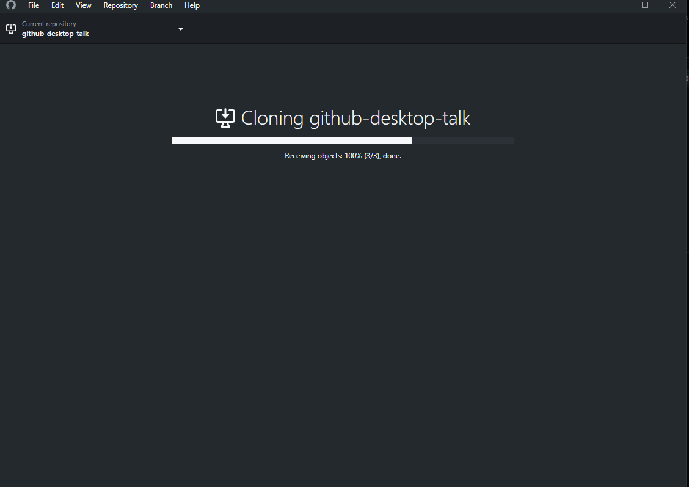

<div align="center">

# 🚀 Git Without the Command Line

### A 5-minute introduction to GitHub Desktop

A simple, visual way to work with Git and GitHub without memorising every command.

<br>


</div>

---

## 🤔 Why GitHub Desktop?

For our mini project and group assignments, git is something we can not skip and, we eventually have to:

> **"push our project to GitHub."**

Using Git from the terminal may involve commands such as:

```bash
git clone <repository-url>
git checkout -b new-branch
git add .
git commit -m "message"
git push
```

These commands are useful to know, but they can feel overwhelming when you're just starting out.

**GitHub Desktop gives us a graphical interface for the same Git workflow.**

> GitHub Desktop does not replace Git.  
> It simply makes Git easier to visualise and use.

---

# 🎬 Demo Workflow

For this demo, I created a GitHub repository and used GitHub Desktop to work with it locally.

```text
GitHub Repository
       │
       ▼
     Clone
       │
       ▼
 Create Branch
       │
       ▼
   Edit Files
       │
       ▼
 Review Changes
       │
       ▼
     Commit
       │
       ▼
      Push
       │
       ▼
     GitHub
```

---

## 1. 📥 Clone the Repository

Normally, using Git from the terminal:

```bash
git clone https://github.com/username/repository.git
```

With GitHub Desktop:

**File → Clone Repository → URL → Clone**

<div align="center">


<br>

*Cloning a GitHub repository using its URL*

</div>

<br>

GitHub Desktop then downloads the repository to the selected local folder.

<div align="center">



<br>

*Repository being cloned to the local machine*

</div>

---

## 2. 🌿 Create a New Branch

Branches allow us to work on something without directly modifying the main branch.

### Terminal

```bash
git checkout -b demo-branch
```

### GitHub Desktop

**Current Branch → New Branch → Create Branch**

For this demo, I created a separate branch before modifying the project.

Branches are useful when:

- developing a new feature
- fixing a bug
- experimenting with code
- working in a team
- avoiding changes directly on `main`

---

## 3. ✏️ Make Changes Locally

Once the repository is cloned, we can open it using any editor:

- VS Code
- Android Studio
- IntelliJ IDEA
- Notepad
- Any other IDE/editor

For this demonstration, the file I changed is:

```text
README.md
```

So technically...

> **This README is part of the demo itself. 😎**

---

## 4. 👀 Review the Changes

One of the best features of GitHub Desktop is its visual diff.

When a file changes, GitHub Desktop clearly shows what was added and removed.

For example:

```diff
+ This line was added.

- This line was removed.
```

This is useful because we can check exactly what we are about to commit.

Instead of:

```bash
git status
git diff
```

we can simply look at the **Changes** tab.

---

## 5. ✅ Commit the Changes

A **commit** is like a checkpoint in the history of a project.

Using the terminal:

```bash
git add .
git commit -m "Add README for GitHub Desktop demo"
```

Using GitHub Desktop:

1. Select the changed files
2. Enter a commit message
3. Click **Commit to branch**

Example commit message:

```text
Add README for GitHub Desktop demo
```

A useful commit message describes **what changed**.

---

## 6. ☁️ Push the Changes

After committing, the changes exist locally.

To send them to GitHub:

### Terminal

```bash
git push origin demo-branch
```

### GitHub Desktop

Click:

> **Push origin**

And that's it.

The changes are now available on GitHub. 🎉

---

# ⚡ Git vs GitHub Desktop

| Task | Git Command | GitHub Desktop |
| :--- | :--- | :--- |
| Clone repository | `git clone` | Clone Repository |
| Create branch | `git checkout -b` | New Branch |
| View changes | `git diff` | Changes tab |
| Check status | `git status` | Changes tab |
| Stage files | `git add` | Select files |
| Commit | `git commit` | Commit button |
| Push | `git push` | Push Origin |
| Pull | `git pull` | Pull Origin |
| View history | `git log` | History tab |

---

# 💡 Why I Like GitHub Desktop

### 👁 Visual

You can clearly see changed files and individual lines of code.

### 🌿 Easier Branching

Creating and switching branches only takes a few clicks.

### 🕒 Clear Commit History

Previous commits can be viewed visually through the **History** tab.

### 🧑‍💻 Beginner Friendly

You can understand Git concepts before worrying about command syntax.

### ⚠️ Fewer Terminal Mistakes

No more seeing:

```text
fatal: not a git repository
```

five minutes before the assignment deadline. 😭

---

# ❓ Does GitHub Desktop Replace Git?

**No.**

It is still important to understand:

- repositories
- branches
- commits
- push
- pull
- merge
- merge conflicts

GitHub Desktop simply provides a graphical interface for these concepts.

A simple way to think about it:

> ### Git is the engine.  
> ### GitHub Desktop is the dashboard.

You don't need to manually control every part of the engine to drive the car, but understanding how it works still makes you a better driver.

---

# in class demo changes